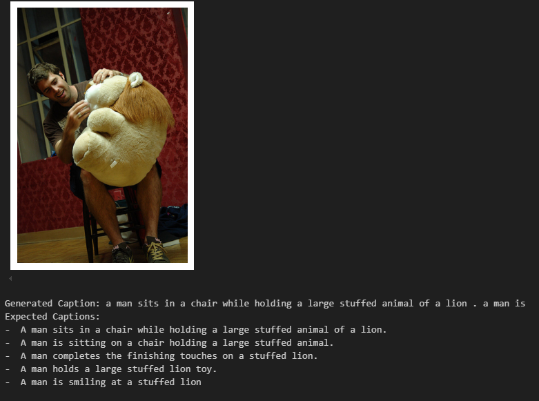

# Multimodal Image Captioning Models

Welcome to the repository showcasing two distinct approaches to image captioning:

1. **LLM-Based Multimodal Transformer**
   - Combines text and image modalities using advanced transformer architectures.
   - Detailed in `readme.md`.

2. **Deep Learning-Based Encoder-Decoder**
   - Uses CNNs and RNNs (LSTMs) for image captioning.
   - Detailed in `readme.md`.

---

## Repository Structure

```
.
├── llm_model/         # Implementation of the multimodal transformer model
├── readme.md          # Documentation for LLM-based multimodal transformer model
├── multimodal-transformer-v7.ipynb
│
├── ml_model/           # Implementation of the CNN-LSTM model
├── readme.md           # Documentation for CNN-LSTM deep learning-based model
└── multimodal-deep-learning.ipynb
```

---

## Prerequisites

1. **Python Version**: Ensure you have Python 3.12 or later.
2. **Hardware Requirements**:
   - GPU recommended for faster training and inference.
3. **Dependencies**:
   Install all required Python packages using:
   ```bash
   pip install -r requirements.txt
   ```

---

## Getting Started

### 1. Clone the Repository

```bash
git clone https://github.com/ruslanmv/multimodal-image-captioning.git
cd multimodal-image-captioning
```

### 2. Dataset Preparation

Both models use the **Flickr30k** dataset. Make sure to download and preprocess it:

### 3. Training

#### For LLM-Based Multimodal Transformer:

```bash
cd llm_model
multimodal-transformer-v7.ipynb
```

#### For CNN-LSTM Deep Learning Model:

```bash
cd ml_model
multimodal-deep-learning.ipynb
```

Example of inference.


---

## Evaluation

Both models support evaluation metrics like:

- **BLEU**
- **METEOR**
- **ROUGE**

Run the respective evaluation scripts to compute these metrics on the validation or test set.

---

## Key Features

### 1. **LLM-Based Multimodal Transformer**

- Incorporates Vision Transformers (ViTs) for image encoding.
- Leverages self-attention and cross-attention mechanisms for multimodal fusion.
- Utilizes advanced tokenization techniques with pre-trained embeddings.

### 2. **CNN-LSTM Deep Learning Model**

- Employs ResNet50 for visual feature extraction.
- Uses LSTM for sequential caption generation.
- Simple, interpretable architecture suitable for educational purposes.

---

## Contributions

We welcome contributions! If you'd like to add features, improve performance, or fix bugs:

1. Fork the repository.
2. Create a feature branch.
3. Submit a pull request with detailed explanations.

---

## License

This project is licensed under the MIT License. See the LICENSE file for details.

---

## Authors

- **Ruslan Magana Vsevolodovna**  
  Researcher and Developer  
  [GitHub Profile](https://github.com/ruslanmv)
  [HomePage](https://ruslanmv.com/)

For further questions or feedback, feel free to open an issue or contact us directly!

